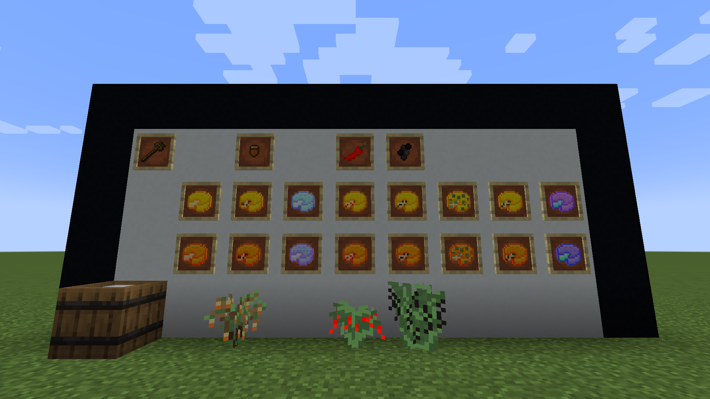

# Cheese Mod

Cheese Mod is a mod for Minecraft 1.17 that adds different kinds of cheeses to the game.

---

### Installation guide

- Download the latest [Fabric Loader](https://fabricmc.net/use/).
- Install the Fabric Loader. Make sure you create a new launcher profile for the Fabric Loader.
- Download the latest [Fabric API](https://www.curseforge.com/minecraft/mc-mods/fabric-api/).
- Put the Fabric APIs JAR in the *mods* folder of your *.minecraft* folder.
- Download the latest [Cheese Mod release](https://github.com/kmatebotond/cheesemod/releases) from GitHub.
- Put the Cheese Mods JAR in the *mods* folder of your *.minecraft* folder.
- You can now launch Minecraft from the Minecraft Launcher. Make sure you have the new launcher profile selected.
